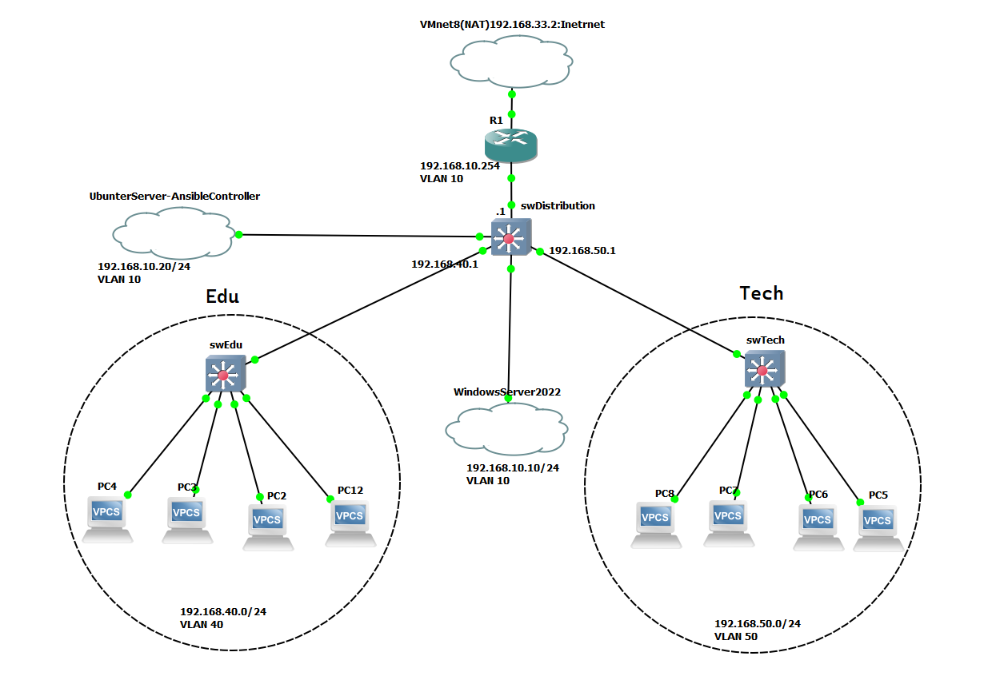
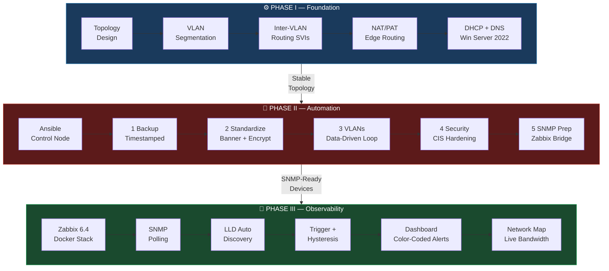
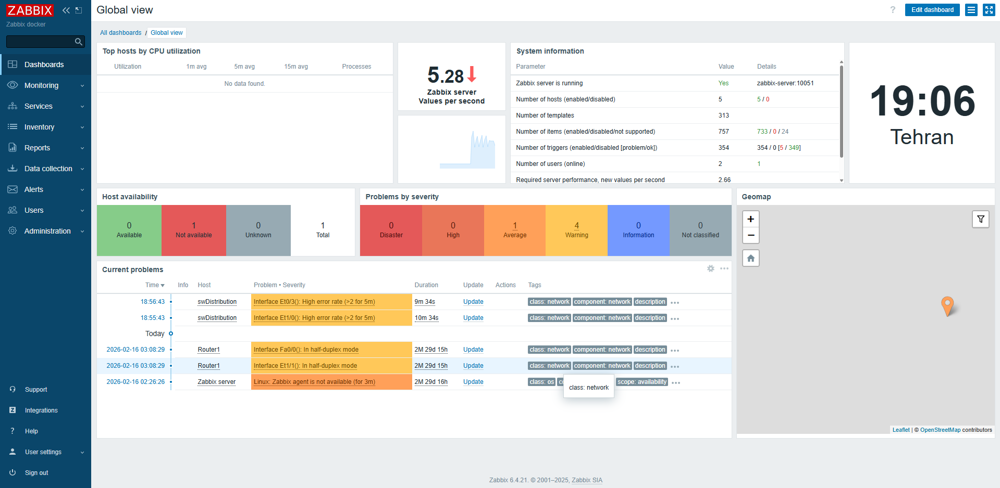
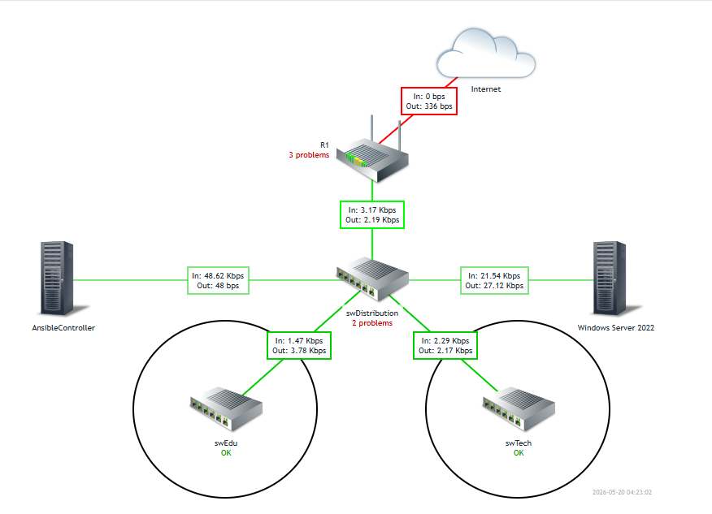
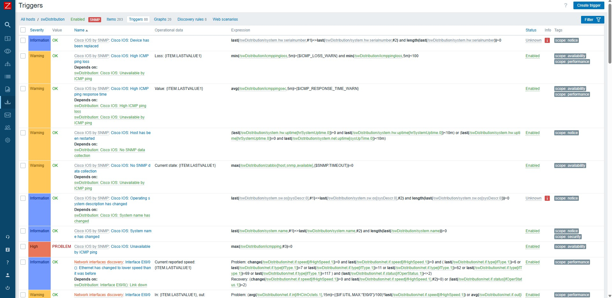
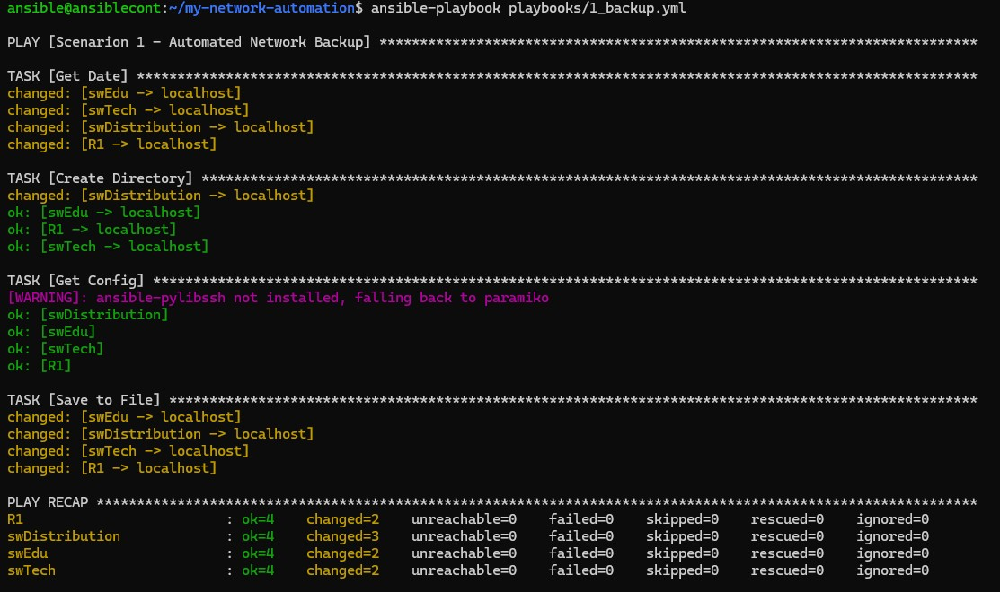

<div align="center">

<br>

```
███╗   ██╗███████╗████████╗██████╗ ███████╗██╗   ██╗ ██████╗ ██████╗ ███████╗
████╗  ██║██╔════╝╚══██╔══╝██╔══██╗██╔════╝██║   ██║██╔═══██╗██╔══██╗██╔════╝
██╔██╗ ██║█████╗     ██║   ██║  ██║█████╗  ██║   ██║██║   ██║██████╔╝███████╗
██║╚██╗██║██╔══╝     ██║   ██║  ██║██╔══╝  ╚██╗ ██╔╝██║   ██║██╔═══╝ ╚════██║
██║ ╚████║███████╗   ██║   ██████╔╝███████╗ ╚████╔╝ ╚██████╔╝██║     ███████║
╚═╝  ╚═══╝╚══════╝   ╚═╝   ╚═════╝ ╚══════╝  ╚═══╝   ╚═════╝ ╚═╝     ╚══════╝
```

### Enterprise Network Design · Ansible Automation · Zabbix Monitoring

<br>

[](https://www.ansible.com/)
[](https://www.zabbix.com/)
[](https://www.docker.com/)
[](https://www.cisco.com/)
[](https://www.python.org/)
[](https://www.gns3.com/)
[](https://ubuntu.com/)
[](LICENSE)

<br>

> **A Unified Approach to Network Design, Purpose-Driven Automation of Operational Scenarios with Ansible,**
> **and Monitoring Implementation with Zabbix in a Small Organization**

<br>

**Mohammad Hossein Sheikhi**
B.Sc. Thesis · Computer Engineering · Academic Year 2025–2026

<br>

[📄 Read the Thesis](docs/thesis.docx) &nbsp;·&nbsp;
[🔧 Ansible Playbooks](ansible/playbooks/) &nbsp;·&nbsp;
[📊 Monitoring Stack](monitoring/) &nbsp;·&nbsp;
[🚀 Quick Start](#-quick-start)

<br>

</div>

---

## 📋 Table of Contents

- [Overview](#-overview)
- [Network Architecture](#-network-architecture)
- [Three-Phase NetDevOps Pipeline](#-three-phase-netdevops-pipeline)
- [Technology Stack](#-technology-stack)
- [Repository Structure](#-repository-structure)
- [Implementation Highlights](#-implementation-highlights)
- [Quick Start](#-quick-start)
- [Results & KPIs](#-results--kpis)
- [Key Innovations](#-key-innovations)
- [Academic Citation](#-academic-citation)
- [Author](#-author)

---

## 🎯 Overview

This repository contains the full implementation of a **NetDevOps pipeline** for enterprise network management — the practical deliverable of a Computer Engineering bachelor's thesis.

The project demonstrates that the core principles of DevOps — **declarative configuration, version control, idempotency, and continuous observability** — can be applied directly to a traditional Cisco-based hierarchical network, without requiring SDN controllers, proprietary tools, or expensive licensing.

The work spans three tightly integrated phases:

| Phase | Focus | Primary Tool | Core Outcome |
|:-----:|-------|:------------:|-------------|
| **I** | Hierarchical Network Design & Deployment | GNS3 + Cisco IOL | Stable 3-layer topology with full VLAN segmentation and inter-VLAN routing |
| **II** | Configuration Automation | Ansible | Five idempotent playbooks covering backup, standardization, VLANs, security hardening, and SNMP preparation |
| **III** | Centralized Monitoring & Observability | Zabbix 6.4 + Docker | Containerized monitoring stack with proactive alerting, LLD, live network maps, and 6-tier severity classification |

---

## 🏗 Network Architecture

```
                              ┌──────────────┐
                              │   INTERNET   │
                              └──────┬───────┘
                                     │  VMnet8 (NAT)
                         ┌───────────▼──────────────┐
                         │         R1 (Router)       │
                         │     Edge / NAT / PAT      │
                         │   Gi0/0: 192.168.33.x     │
                         │   Gi0/1: 192.168.10.254   │
                         └───────────┬──────────────┘
                                     │  Layer 3 Routed Link
                         ┌───────────▼──────────────┐
                         │    swDistribution          │
                         │    Layer 3 Core Switch     │
                         │  ┌────────────────────┐   │
                         │  │  VLAN 10  SVI .1   │   │  ← Management
                         │  │  VLAN 40  SVI .1   │   │  ← Education
                         │  │  VLAN 50  SVI .1   │   │  ← Technology
                         │  │  VLAN 99  Native   │   │
                         │  └────────────────────┘   │
                         └────────┬─────────┬─────────┘
                                  │         │
                   Trunk (802.1Q) │         │ Trunk (802.1Q)
                 ┌────────────────▼──┐  ┌───▼──────────────────┐
                 │      swEdu        │  │       swTech          │
                 │   Access Switch   │  │    Access Switch      │
                 │   VLAN 40 + Mgmt  │  │    VLAN 50 + Mgmt     │
                 └────────┬──────────┘  └──────────┬────────────┘
                          │                         │
              ┌───────────▼──────┐      ┌───────────▼──────────┐
              │  Education PCs    │      │   Technology PCs      │
              │  192.168.40.0/24  │      │   192.168.50.0/24    │
              │  DHCP via Win2022 │      │   DHCP via Win2022   │
              └───────────────────┘      └──────────────────────┘

  ╔══════════════════════ VLAN 10 — Management Backbone ═════════════════════╗
  ║                                                                          ║
  ║  ┌─────────────────────┐            ┌───────────────────────┐            ║
  ║  │   Ubuntu 20.04 LTS  │            │   Windows Server 2022 │            ║
  ║  │   192.168.10.20     │            │    192.168.10.10      │            ║
  ║  │  ┌───────────────┐  │            │  ┌─────────────────┐  │            ║
  ║  │  │ Ansible 2.15+ │  │            │  │   DHCP Server   │  │            ║
  ║  │  │ Control Node  │  │            │  │   DNS Server    │  │            ║
  ║  │  ├───────────────┤  │            │  └─────────────────┘  │            ║
  ║  │  │ Docker 24.x   │  │            └───────────────────────┘            ║
  ║  │  │ ┌───────────┐ │  │                                                 ║
  ║  │  │ │  Zabbix 6 │ │  │                                                 ║
  ║  │  │ │ PostgreSQL│ │  │                                                 ║
  ║  │  │ │  Nginx    │ │  │◄── SNMP polls all devices via VLAN 10           ║
  ║  │  │ └───────────┘ │  │                                                 ║
  ║  │  └───────────────┘  │                                                 ║
  ║  └─────────────────────┘                                                 ║
  ╚══════════════════════════════════════════════════════════════════════════╝
```

---



---

## 🔄 Three-Phase NetDevOps Pipeline



---

## 🛠 Technology Stack

| Category | Technology | Version | Purpose |
|----------|-----------|:-------:|---------|
| **Emulation** | GNS3 | 2.x | Full network testbed with real IOS |
| **Network OS** | Cisco IOL (IOS-on-Linux) | 15.x | L2/L3 switches + edge router |
| **Automation** | Ansible | 2.15+ | Agentless configuration management |
| **SSH Transport** | `network_cli` connection plugin | — | Persistent SSH sessions to Cisco IOS |
| **Monitoring** | Zabbix Server | 6.4 | SNMP polling, triggers, alerting |
| **Database** | PostgreSQL | 13 | Zabbix history & trends backend |
| **Web UI** | Nginx + PHP | — | Zabbix frontend |
| **Containers** | Docker + Compose | 24.x | Full Zabbix stack deployment |
| **Control Node OS** | Ubuntu Server | 20.04 LTS | Ansible + Docker host |
| **Services OS** | Windows Server | 2022 | DHCP, DNS |
| **Monitoring Protocol** | SNMPv2c | — | Telemetry transport layer |
| **Version Control** | Git | — | Infrastructure-as-Code backbone |

---

## 📁 Repository Structure

```
netdevops-enterprise-network/
│
├── 📄  README.md                          ← You are here
│
├── 📂  ansible/
│   ├── inventory.ini                      ← Device groups & connection variables
│   ├── ansible.cfg                        ← Control node defaults
│   └── playbooks/
│       ├── 1_backup.yml                   ← Timestamped config backup to local disk
│       ├── 2_standardize.yml              ← MOTD, password encryption, DNS
│       ├── 3_vlan.yml                     ← Data-driven VLAN provisioning (VTP transparent)
│       ├── 4_security.yml                 ← CIS-aligned hardening (SSH, VTY, CDP, HTTP)
│       └── 5_monitoring_prep.yml          ← SNMP community for Zabbix integration
│
├── 📂  monitoring/
│   ├── docker-compose.yml                 ← Full Zabbix 6.4 stack (server + web + PostgreSQL)
│   └── daemon.json                        ← Docker registry mirror config (sanctions workaround)
│
├── 📂  ci/
│   └── gitlab-ci.yml                      ← Reference CI/CD design: validate → dry-run → deploy
│
├── 📂  docs/
│   ├── thesis.docx                        ← Full academic thesis document
│   └── ip-addressing.md                   ← IP plan, VLAN table, and device roles
│
└── 📂  screenshots/
    ├── topology.jpg                        ← GNS3 network topology
    ├── zabbix_dashboard.png                ← Live monitoring dashboard
    ├── zabbix_network_map.png              ← Interactive network map with live bandwidth
    ├── zabbix_triggers.jpg                 ← Configured trigger list
    └── ansible_playrecap.jpg              ← Ansible execution output
```

---

## ✨ Implementation Highlights

### 🔁 Five-Playbook Ansible Pipeline

Each playbook is a **single-responsibility, idempotent unit**.
The full pipeline can be re-run safely at any time — no side effects, no surprises.

<details>
<summary><b>Scenario 1 — Dynamic Timestamped Backup</b></summary>

```yaml
# Creates a timestamped folder, saves each device's running-config locally
- name: Get Date
  command: date +%Y-%m-%d_%H:%M
  register: date_var
  delegate_to: localhost

- name: Save Config to Timestamped File
  copy:
    content: "{{ config_output.stdout[0] }}"
    dest: "./backups/{{ date_var.stdout }}/{{ inventory_hostname }}.txt"
  delegate_to: localhost
```
</details>

<details>
<summary><b>Scenario 3 — Data-Driven VLAN Provisioning</b></summary>

```yaml
# To add or remove a VLAN: edit only the vars block — zero logic change needed
vars:
  my_vlans:
    - { id: 10, name: mgmt  }
    - { id: 40, name: edu   }
    - { id: 50, name: tech  }
    - { id: 99, name: native }

tasks:
  - name: Create and Name VLANs
    ios_config:
      parents: vlan {{ item.id }}
      lines:  [ name {{ item.name }} ]
    loop: "{{ my_vlans }}"
```
</details>

<details>
<summary><b>Idempotency Guard — Only Write to NVRAM When Something Changed</b></summary>

```yaml
# Skips the NVRAM write entirely if this run made no changes
- name: Save Config
  ios_config:
    save_when: modified
```
</details>

---

### 📦 Containerized Zabbix Stack

One command boots the entire monitoring platform:

```bash
cd monitoring/
docker compose up -d
```

Three containers, one bridge network, zero dependency conflicts:

```
postgres-server   ←→   zabbix-server   ←→   zabbix-web
 PostgreSQL 13       Zabbix 6.4 LTS        Nginx + PHP
(persistent vol)     (port 10051)           (port 8080)
```

**Monitoring capabilities deployed in this project:**

| Capability | Details |
|-----------|---------| 
| 🟢 SNMP Polling | All 4 Cisco devices via `Cisco IOS by SNMP` template |
| 🔍 Low-Level Discovery (LLD) | Auto-detects switch interfaces — no manual item creation |
| 🔔 Trigger + Hysteresis | Separate ON/OFF thresholds — eliminates alert flapping |
| 🚨 6-Tier Severity | Not Classified → Information → Warning → Average → High → Disaster |
| 🗺️ Live Network Map | Interactive topology with real-time bandwidth via expression macros |
| 📈 History & Trends | 90-day raw history · 365-day aggregated trends |
| 🖥️ Dashboard Alerting | Color-coded event display on centralized Zabbix dashboard |

---

### 🔗 Ansible → Zabbix Integration Bridge

Playbook 5 (`5_monitoring_prep.yml`) is the architectural glue between Phase II and Phase III.
It configures SNMP uniformly across all devices so that the moment Zabbix starts, polling works immediately — **zero manual switch configuration**.

```
┌──────────────────────────────────────────────────────────┐
│   Phase II ends with 5_monitoring_prep.yml               │
│                                                          │
│   Ansible ──► All switches: SNMP community configured   │
│                                                          │
│   Phase III begins:                                      │
│                                                          │
│   docker compose up -d ──► Zabbix starts polling ✅     │
└──────────────────────────────────────────────────────────┘
```

---

## 🚀 Quick Start

> ⚠️ **Important:** This project runs on **Cisco IOL images**, which are Cisco-proprietary and not included in this repository. You need a valid GNS3 setup with IOL images to reproduce the network environment. The Ansible and Docker components are fully open-source and portable.

### Prerequisites

- GNS3 ≥ 2.x with Cisco IOL L2 and L3 images
- Ubuntu Server 20.04 LTS VM connected to the GNS3 topology
- Docker 24.x + Docker Compose installed on the Ubuntu VM
- Python 3.10+ and pip

### Step 1 — Clone the Repository

```bash
git clone https://github.com/mhsheikhi/netdevops-enterprise-network.git
cd netdevops-enterprise-network
```

### Step 2 — Install Ansible and Dependencies

```bash
sudo apt update && sudo apt install -y ansible python3-pip
pip3 install paramiko netmiko --break-system-packages
```

### Step 3 — Configure Your Inventory

Edit `ansible/inventory.ini` and set the correct IP addresses for your GNS3 devices.

> **Security note:** Credentials are stored in plaintext for lab purposes only. For production, use Ansible Vault:
> ```bash
> ansible-vault encrypt_string 'your_password' --name 'ansible_password'
> ```

### Step 4 — Verify Device Connectivity

```bash
ansible -i ansible/inventory.ini network_devices -m ios_command -a "commands='show version'"
```

### Step 5 — Run the Full Automation Pipeline

```bash
ansible-playbook -i ansible/inventory.ini ansible/playbooks/1_backup.yml
ansible-playbook -i ansible/inventory.ini ansible/playbooks/2_standardize.yml
ansible-playbook -i ansible/inventory.ini ansible/playbooks/3_vlan.yml
ansible-playbook -i ansible/inventory.ini ansible/playbooks/4_security.yml
ansible-playbook -i ansible/inventory.ini ansible/playbooks/5_monitoring_prep.yml
```

### Step 6 — Deploy the Zabbix Monitoring Stack

```bash
# If Docker Hub is blocked (Iranian IPs): apply domestic mirror config first
sudo cp monitoring/daemon.json /etc/docker/daemon.json
sudo systemctl restart docker

# Deploy the full Zabbix stack
cd monitoring/
docker compose up -d

# Zabbix web UI
# URL:      http://192.168.10.20:8080
# Username: Admin
# Password: zabbix
```

After login: navigate to **Monitoring → Hosts**, attach the `Cisco IOS by SNMP` template to each device, and polling begins immediately.

---

## 📊 Results & KPIs

| Metric | Traditional CLI | This NetDevOps Pipeline | Change |
|--------|:--------------:|:-----------------------:|:------:|
| Config deployment time | Minutes, sequential | Seconds, parallel | ✅ |
| Configuration drift | Undetected until failure | Eliminated for enforced parameters | ✅ |
| MTTD | Hours (user reports) | Seconds (Zabbix trigger) | ✅ |
| Human error surface | Every CLI session | Reduced to near zero | ✅ |
| Monitoring license cost | High (SolarWinds/PRTG) | **Zero** (open-source) | ↓ 100% |
| Stack re-deployment | Days (manual reinstall) | `docker compose up -d` | ✅ |
| Audit trail | None | Full Git history | ✅ |
| Rollback capability | Manual CLI reversal | `git revert` + re-run | ✅ |

---

## 💡 Key Innovations

### 1 — Sanctions-Resilient Container Deployment

Docker Hub is blocked at the network layer for Iranian IP ranges (HTTP 403 / TLS handshake timeout). This project implements a reproducible workaround: re-routing all container image pulls through domestic Iranian registry mirrors by configuring `/etc/docker/daemon.json`:

```json
{
  "registry-mirrors": [
    "https://registry.docker.ir",
    "https://docker.arvancloud.ir"
  ]
}
```

All Zabbix images downloaded at full line speed. **A documented, reproducible model for deploying containerized infrastructure under international sanctions.**

---

### 2 — NetDevOps on Vendor Hardware — No SDN Required

The complete DevOps lifecycle — IaC, version control, idempotency, and continuous observability — is demonstrated here on **traditional Cisco IOS-based switching hardware**, not cloud-native or SDN environments. No proprietary controller. No NMS license. No vendor lock-in.

---

### 3 — Automation-First Monitoring Bootstrap

Playbook 5 pre-configures SNMP on every device before Zabbix even starts. The result: zero manual switch interaction after `docker compose up -d`. The monitoring system comes online with full visibility already in place.

---

### 4 — Live Network Map with Expression Macros

Zabbix 6.x expression macros were configured on network map links to display real-time bandwidth. For example, the link label on swEdu was set to:

```
In:  {?last(/swEdu/net.if.in[ifHCInOctets.1])}
Out: {?last(/swEdu/net.if.out[ifHCOutOctets.1])}
```

This turns the static topology diagram into a live operational dashboard — traffic bottlenecks visible at a glance.

---

## 📸 Screenshots

### Network Topology (GNS3)


### Zabbix Dashboard


### Live Network Map


### Configured Triggers


### Ansible — Play Recap


---

## 📚 Academic Citation

```bibtex
@thesis{sheikhi2026netdevops,
  author   = {Mohammad Hossein Sheikhi},
  title    = {A Unified Approach to Network Design, Purpose-Driven Automation
              of Operational Scenarios with Ansible, and Monitoring Implementation
              with Zabbix in a Small Organization},
  school   = {Salman Farsi University of Kazerun},
  type     = {Bachelor's Thesis},
  year     = {2026},
  advisor  = {Dr. Parham Arjmand},
  url      = {https://github.com/mhsheikhi/netdevops-enterprise-network}
}
```

---

## 👤 Author

<div align="center">

**Mohammad Hossein Sheikhi**

B.Sc. Computer Engineering · Salman Farsi University of Kazerun · 2025–2026

<br>

[](https://github.com/mhsheikhi)

</div>

---

<div align="center">

*Built entirely on open-source tools · No vendor lock-in · No licensing fees*

`Cisco IOS` · `Ansible` · `Zabbix` · `Docker` · `PostgreSQL` · `GNS3` · `Python` · `Ubuntu`

<br>

⭐ **If this project helped you, consider leaving a star.**

</div>
